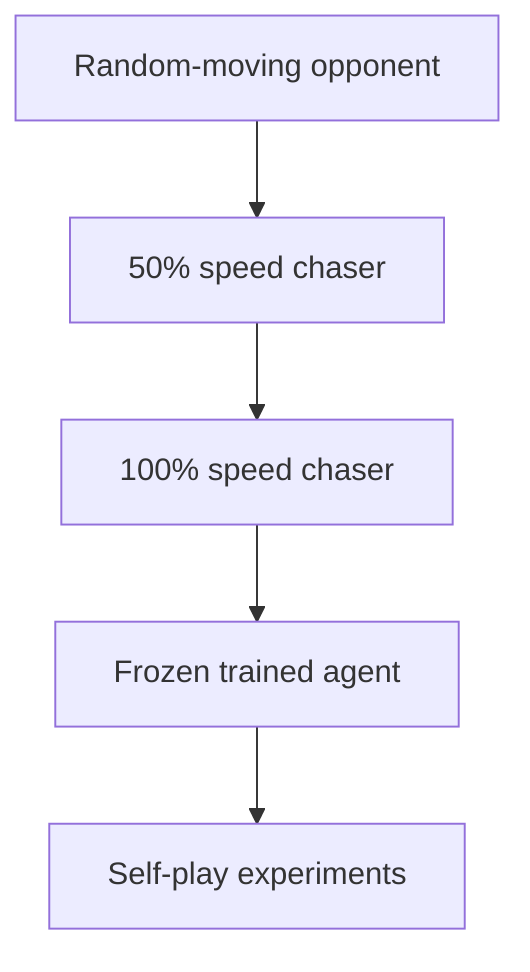
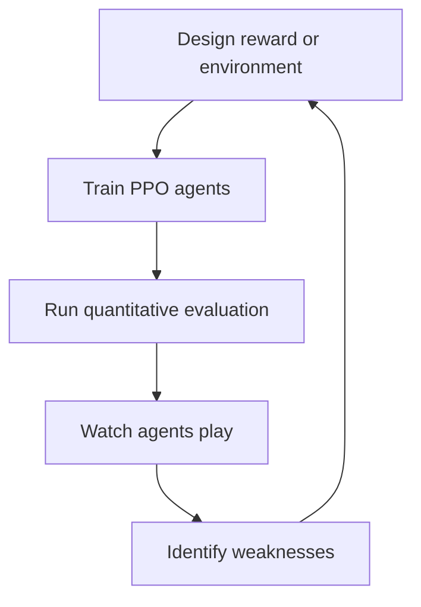
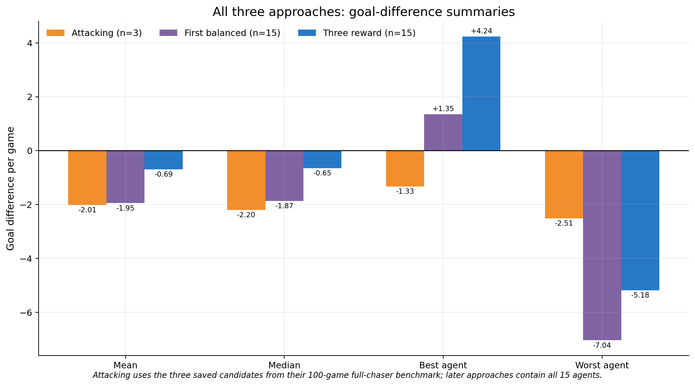
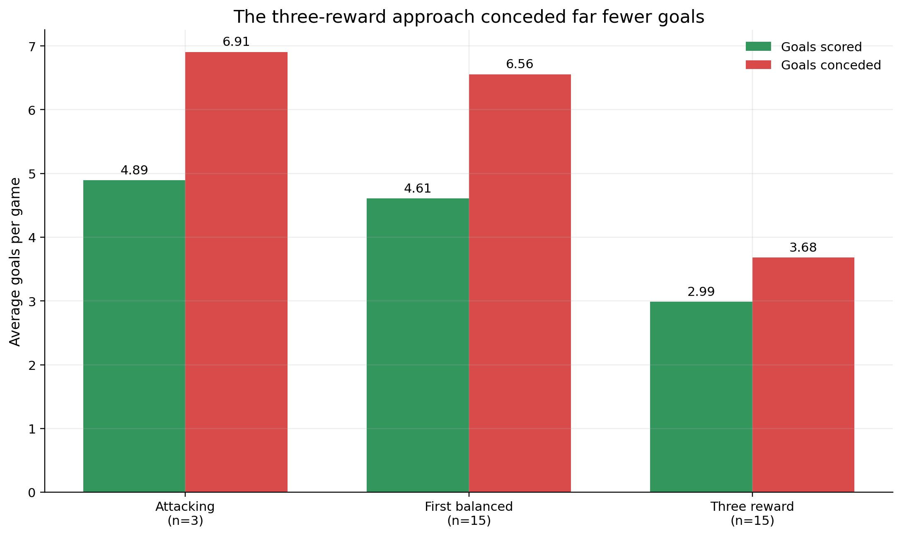
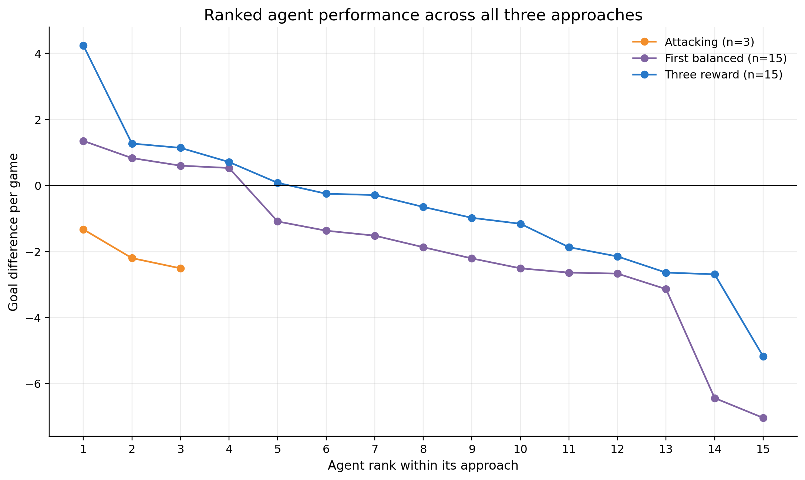
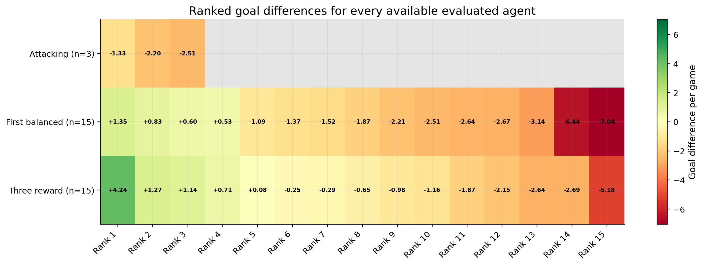
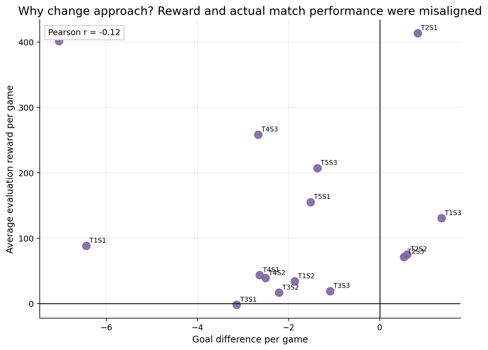
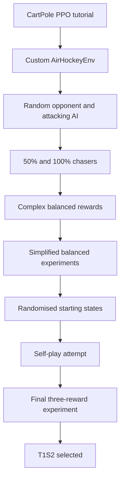

# Air Hockey Reinforcement Learning Agent

A custom air-hockey simulation and reinforcement-learning project built with Python, Gymnasium, Pygame and Stable-Baselines3 PPO.

The project began as a way to learn the fundamentals of reinforcement learning and developed into a complete experimental workflow involving environment design, collision physics, reward engineering, Optuna hyperparameter tuning, scripted opponents, self-play, quantitative evaluation and manual gameplay analysis. Its central question became: **does adding more guidance to a reward function actually produce a better air-hockey agent?**

The final experiment tested five reward configurations, called **trials**. Each configuration was used to train three independent PPO agents with different random seeds, producing 15 agents in total. Agent names therefore use the format `T#S#`: `T1S2`, for example, means **Trial 1, Seed 2**. Trial 1 identifies the reward configuration; Seed 2 identifies the second independent training run using it.

The strongest observed agent was **Final Three-Reward - Trial 1 Seed 2 (T1S2)**. Across 100 evaluation games against the 100%-speed chaser, it scored **5.45 goals per game**, conceded **1.21**, and achieved a **+4.24 goal difference per game**. Trial 1 was also the best reward configuration according to the experiment's median-of-three objective, although its three seeds varied widely. This distinction between a good configuration and one particularly strong trained policy is an important part of the project.

## Project Highlights

I designed a vertical air-hockey environment compatible with the Gymnasium API and trained continuous-control PPO policies using Stable-Baselines3. The project progressed through three main reward approaches: an attacking system, a more complex balanced system and a final system using only three direct reward types. Optuna was used to tune reward values, while multiple seeds were trained for each configuration to expose the variability of reinforcement learning.

Agents were evaluated over repeated 60-second games against standardised scripted opponents, but numerical evaluation was never used alone. After every major training session, I loaded the trained agents into the rendered Pygame environment and watched them play. This revealed behaviours that totals could not explain, including approaching without hitting, waiting after conceding and obtaining very high shaped reward despite poor goal difference.

The project also required repeated engineering work on the environment itself. Wall collisions, object overlap, post-goal respawns and stuck-puck detection were revised as problems appeared. Opponents progressed from random movement to half-speed and full-speed chasers, followed by an experimental frozen-model self-play stage.

## Project Aim and Origins

This project began as a summer introduction to machine learning. Before attempting air hockey, I worked through a PPO example using `CartPole-v1` to understand the basic interaction between an agent and a Gymnasium environment:

```text
observation -> action -> environment update -> reward -> next observation
```

CartPole provided a useful starting point because the environment, reward and success criterion already existed. Air hockey required all of those parts to be designed from scratch. The project therefore became an exercise in both **reinforcement learning** and **simulation engineering**.

The original aim was to learn how the Gymnasium API structures a reinforcement-learning problem and how PPO learns a policy through repeated interaction. Building air hockey instead of relying on a prepared benchmark meant also implementing movement, goals and collision physics. As the work developed, the focus expanded to structured experiments with Optuna and repeated random seeds, investigating how reward design changes behaviour, distinguishing high mathematical reward from genuinely effective gameplay, and eventually creating a trained opponent that a person could play against.

Air hockey was a useful test problem because it combines continuous movement, physical interaction, attack, defence and delayed consequences. A paddle may need to move into position before it can hit the puck, and a locally useful action may lead to conceding several seconds later. This made it much more demanding than simply rewarding a single immediate action.

The finished project was not produced in one pass. It developed through repeated cycles of implementation, training, evaluation and observation. After every significant training session, the resulting games were rendered and watched. What happened on screen determined the next change: sometimes the reward function needed revision, sometimes the opponent needed to become stronger, and sometimes the real fault was in the environment physics rather than the neural network.

## Scope of the Work

The completed project combined object-oriented Python and inheritance from `gymnasium.Env` with continuous observation and action spaces, vector mathematics, two-dimensional collision handling and PPO policy training. It also involved sparse and dense reward shaping, Optuna optimisation, repeated random seeds, deterministic post-training evaluation, manual qualitative analysis, curriculum-style opponent progression, saved-model compatibility, self-play and statistical visualisation with Matplotlib.

The result is best understood as an experimental record rather than only a showcase of the final agent. Successful policies were important, but failed reward systems, physics bugs and unexpected behaviour were equally valuable because each one provided evidence for the next design decision.

## Headline Results

The following comparison uses the saved full-chaser evaluations. The attacking data contains the three candidates preserved in its 100-game benchmark. The first-balanced and final three-reward datasets each contain **15 agents: five Optuna trials multiplied by three random seeds per trial**.

| Approach | Evaluated agents | Mean goals scored | Mean goals conceded | Mean goal difference | Median goal difference | Best agent |
|---|---:|---:|---:|---:|---:|---:|
| Attacking | 3 selected candidates | 4.89 | 6.91 | -2.01 | -2.20 | -1.33 |
| First balanced | 15 | 4.61 | 6.56 | -1.95 | -1.87 | +1.35 |
| **Final three-reward** | **15** | **2.99** | **3.68** | **-0.69** | **-0.65** | **+4.24** |

The final approach did not simply score more frequently. Its main improvement was that it **conceded far fewer goals**, resulting in a substantially better goal difference.

> **Comparison limitation:** these are genuine historical results, but they do not form a perfectly controlled scientific comparison. The environments evolved, the attacking sample contains only three preserved candidates, the first-balanced agents trained for 300,000 timesteps, and the final agents trained for 500,000. The safe conclusion is that the final experiment worked considerably better overall, not that reward simplification alone caused the entire improvement.

## What I Built

At the centre of the project is a custom Gymnasium environment implementing the table, observations, actions, rewards, collisions, goals, resets and episode logic. A Pygame renderer made it possible to watch policies and play manually, while separate training code handled PPO, multiple seeds and Optuna optimisation. Evaluation scripts recorded goals scored, goals conceded, goal difference and reward, and the saved results were later processed into comparison tables and figures.

The project also contains several opponent controllers. Training began against random movement before progressing to half-speed and full-speed chasers, and a later experiment used a frozen PPO policy. Human-play programs allowed the environment to be tested against both the scripted chaser and the selected T1S2 model.

### Environment class

`AirHockeyEnv` inherits from `gymnasium.Env`. This provides the standard interface expected by Stable-Baselines3 while allowing the game itself to be customised.

The most important environment methods were:

| Method | Purpose |
|---|---|
| `__init__()` | Defines the table, physical constants, state variables, observation space and action space. |
| `reset()` | Starts a new episode or resets the table state after setup. It returns the first observation while the trained policy itself keeps its learned network parameters. |
| `step(action)` | Applies an action, updates paddles and puck, resolves collisions, checks for goals, calculates reward and returns the next state. |
| `render()` | Draws the current state through Pygame so a human can inspect the game. |
| `_get_observation()` | Converts the current game state into the numerical vector supplied to PPO. |

The environment therefore defines the project's **Markov Decision Process**: its states, permitted actions, transitions and rewards.

### Physics and game logic

The simulation was responsible for much more than drawing circles. It had to keep the puck inside the playable boundary except while it passed through a goal, restrict each paddle to its legal half and prevent circular objects from remaining overlapped. Paddle movement needed to transfer velocity to the puck, puck speed had to remain below its maximum, and wall collisions had to reflect the correct velocity component. The same update loop also detected scoring, issued the correct reward, created a valid post-goal state and prevented low-speed corner situations from continuing indefinitely.

Many apparent "AI problems" were eventually traced to one of these environment rules. This reinforced an important point: a policy cannot learn sensible behaviour if the world it interacts with behaves incorrectly.

## Final Environment

| Setting | Value |
|---|---:|
| Table width | 300 |
| Table height | 600 |
| Border | 30 |
| Goal width | 108 |
| Puck radius | 11 |
| Paddle radius | 21 |
| Puck mass | 1.0 |
| Paddle mass | 1.5 |
| Paddle speed | 8.0 |
| Maximum puck speed | 20.0 |

### Observation space

The observation contained 12 continuous values:

```text
[
    puck_x, puck_y, puck_vx, puck_vy,
    blue_x, blue_y, blue_vx, blue_vy,
    red_x, red_y, red_vx, red_vy
]
```

This gave the policy the position and velocity of every moving object. The values described the current state rather than supplying high-level labels such as "defend" or "shoot". PPO therefore had to learn useful relationships between these numbers and its actions.

The actual final game physics used a maximum puck speed of 20 and paddle speed of 8. Some saved models expected wider declared observation bounds of +/-25 for puck velocity and +/-10 for paddle velocity. Those wider declarations did not change the physical speeds, but they mattered when loading a saved neural network because Stable-Baselines3 checks environment compatibility.

### Action space

The general two-player environment supported four continuous action components:

```text
[blue_x, blue_y, red_x, red_y]
```

Each component was clipped to the interval `[-1, 1]` and scaled by the paddle speed. In most training environments, PPO controlled only BLUE through a two-component action `[blue_x, blue_y]`, while the training class calculated RED's action using the selected scripted or frozen opponent.

This was a continuous control problem. The policy was not choosing from a small list such as "up", "down", "left" or "right"; it could request combinations of horizontal and vertical motion at different magnitudes.

### Coordinate system and table layout

The table was vertical, with the RED goal at the top and the BLUE goal at the bottom. BLUE normally occupied the lower half and attacked upward, while RED occupied the upper half and attacked downward. The border made the goal openings and edge collisions easier to see in the rendered window.

### Collision model

Puck-paddle contacts were treated as collisions between circular physical objects. The collision normal was calculated from the line joining their centres, overlap was removed, and velocity was updated using the object masses and paddle motion.

For wall contacts, the puck was first returned to a valid position and then the velocity component perpendicular to the wall was reflected. This produces the intended specular behaviour: the outgoing angle mirrors the incoming angle instead of allowing the puck to remain partly inside and travel along the wall.

### Resets and randomisation

Earlier versions used fixed starts. Later experiments randomised the initial puck and paddle positions so that an agent could not depend on one memorised opening sequence.

Goal respawns were also revised. The puck and conceding paddle were placed on sensible points in the conceding half, giving that side an opportunity to re-engage. The low-speed timer was cleared after a goal so the new puck position would not immediately be mistaken for a stuck state.

Together, these revisions produced a vertical table with separate BLUE and RED halves, visible goal openings, post-goal respawns, circular puck-paddle collision physics, speed limits, specular wall reflection and overlap prevention. Later experiments also used randomised starting positions. A stuck-puck detector reset the puck when its speed stayed below approximately 10% of maximum for 1.5 seconds.

## Technologies

| Technology | Use in the project |
|---|---|
| Python | Environment, experiments and analysis |
| Gymnasium | Standard reinforcement-learning environment interface |
| Stable-Baselines3 | PPO implementation |
| Pygame / pygame-ce | Rendering and manual control |
| NumPy | Numerical state and vector calculations |
| Optuna | Hyperparameter and reward-value optimisation |
| Matplotlib | Analysis graphs |
| Pandas | Results processing |

## Reinforcement-Learning Setup

### Agent

The learning policy controlled the BLUE paddle. The RED paddle was controlled by a scripted opponent or, during self-play experiments, a frozen PPO model.

### Algorithm

The agent used **Proximal Policy Optimisation (PPO)**. PPO represents the policy using a neural network and updates it gradually while limiting excessively large policy changes. Stable-Baselines3 handled the neural-network layers, weights, biases and optimisation process.

PPO was a suitable choice because the paddle action was continuous. The neural network received the observation vector and produced an action distribution. During training, actions were sampled from this distribution so that the policy continued exploring alternatives. PPO then compared the outcomes of those actions and adjusted the network in the direction of higher expected return.

I did not manually edit individual neural-network weights or biases. Stable-Baselines3 handled that optimisation in the background. My work focused on defining the environment, observations, action limits, opponents, rewards, experimental settings and evaluation criteria that determined what the network could learn.

### Training and evaluation behaviour

Training and evaluation served different purposes:

| Mode | Policy action | Purpose |
|---|---|---|
| Training | Stochastic sampling | Encourages exploration and gives the policy experience with different actions. |
| Evaluation | Deterministic action selection | Makes comparisons more repeatable by using the policy's preferred action. |

Environment randomisation could still produce different game states even when policy actions were deterministic. Deterministic evaluation therefore did not mean that every game had to be identical; it meant that the model was not deliberately sampling an extra random action from its policy distribution.

### Episodes and timesteps

One timestep followed the sequence:

```text
observe state -> choose action -> update environment -> receive reward
```

An episode represented a complete timed game. Scoring a goal reset the table state, but play continued until the episode duration ended.

The distinction between a timestep and an episode was important. Training for 500,000 timesteps did not mean playing 500,000 complete games. It meant performing approximately 500,000 individual environment interactions across many episodes.

Different project stages used different training budgets. Shorter experiments were useful for rejecting clearly unsuccessful reward systems, while the final experiment used 500,000 timesteps per seed.

### Opponents

The opponent difficulty evolved during the project:



The chaser moved toward the puck when it entered the relevant half and otherwise returned toward a waiting position. This provided a repeatable benchmark that was more demanding than random movement.

### Why the opponent changed

The random-moving opponent allowed the first policy to discover basic puck contact and attacking behaviour. Once the agent could exploit that opponent, it no longer provided a demanding test. A half-speed chaser was introduced as an intermediate difficulty, followed by a full-speed chaser.

This approximately formed a curriculum:

```text
random movement
-> 50% chaser
-> 100% chaser
-> frozen trained policy
```

The curriculum was not perfectly linear because unsuccessful self-play experiments caused a return to the controlled chaser. That reversal was useful: a more complicated opponent is not automatically a better learning environment if it creates stable inactivity or makes evaluation harder to interpret.

## Experimental Method

Each experiment began by defining or revising the reward system and selecting the ranges Optuna could test. Several reward configurations were proposed, and multiple PPO agents were trained from different random seeds for each configuration. Periodic training statistics were recorded where the script supported them.

After training, each model was frozen and evaluated over repeated 60-second games. These evaluations recorded goals scored, goals conceded, goal difference and, where available, average reward. The same policies were then loaded into Pygame and watched. Numerical results and visible behaviour were considered together before deciding whether the next iteration required a change to the rewards, opponent, environment or training setup.

### Trials, seeds and Optuna

An **Optuna trial** represented one reward configuration. A trial might specify values such as the hit reward, approach reward, concede penalty or cooldown. In each of the main later experiments, Optuna proposed **five configurations**. Three PPO agents were trained independently for each trial using Seeds 1, 2 and 3, producing 15 agents:

```text
Trial 1 -> T1S1, T1S2, T1S3
Trial 2 -> T2S1, T2S2, T2S3
Trial 3 -> T3S1, T3S2, T3S3
Trial 4 -> T4S1, T4S2, T4S3
Trial 5 -> T5S1, T5S2, T5S3
```

The `T` part identifies a shared reward configuration and the `S` part identifies an independent training run. T1S1, T1S2 and T1S3 therefore used exactly the same reward values, but their neural-network training followed different stochastic paths. They could still become attacking, defensive, passive or ineffective, so judging a trial from one lucky seed would be unreliable.

Early experiments sometimes optimised an average result. Later experiments increasingly used a median across three seeds because the median was less dominated by one unusually strong or weak run. The final three-reward study made the most important change: Optuna maximised **median goal difference**, aligning its objective with match performance instead of the internally designed reward total.

This explains the distinction between the final study's winning configuration and its winning model. **Trial 1 was the best reward configuration** because the median goal difference of T1S1, T1S2 and T1S3 was +0.71. **T1S2 was the best individual agent** because that specific policy achieved +4.24. The other two Trial 1 seeds achieved -5.18 and +0.71, showing why a configuration and one model trained from it should not be treated as the same result.

### Typical experiment sizes

| Stage | Typical trials | Seeds per trial | Timesteps per seed | Evaluation |
|---|---:|---:|---:|---:|
| Early attacking | 10 | Stage-dependent | 200,000 | 100 x 60-second games |
| Attacking V5 | 5 | 3 | 200,000 | 100 x 60-second games |
| First balanced full chaser | 5 | 3 | 300,000 | 100 x 60-second games |
| Final three-reward | 5 | 3 | 500,000 | 100 x 60-second games |

These values changed as the project developed. They should be read as the recorded conditions for each stage, not as one single controlled experiment repeated unchanged throughout the entire project.

### What was recorded

Depending on the stage and surviving output files, the project recorded periodic average reward during training, explained variance from the PPO value network, BLUE and RED goals, goal difference, and sometimes wins, draws and losses. The reward parameters and model path for each Optuna trial were also saved. These numerical records were supplemented by observations made while watching the rendered agents.

Not every historical script saved every metric. This is why the comparison figures use only values that genuinely survived, and why the attacking full-chaser sample is smaller than the two later datasets.

### Quantitative and qualitative evaluation

Numerical metrics were never used in isolation. After each major training session, the agents were loaded back into the rendered environment and their games were watched manually. I checked whether an agent approached the puck and actually made contact, how strongly and accurately it attacked, whether it returned to defend, and whether it became passive after conceding. Watching also exposed agents becoming trapped near walls, exploiting intermediate rewards, behaving very differently from other seeds or reacting poorly to unusual starting states.

This created an iterative loop:



Watching the agents was especially important because a high reward did not always correspond to good air-hockey performance.

## The Three Main Approaches

### Approach 1: Attacking AI

The first approach attempted to teach aggressive puck movement and goal scoring against a random-moving opponent.

Its reward function grew around the idea of purposeful attack. Scoring and puck contact were rewarded, while further signals tried to recognise movement toward the opponent's goal and useful velocity alignment. Chase rewards encouraged engagement, with cooldowns intended to stop a single event being counted repeatedly. Opponent touches and blocks could be penalised. An early wall-bounce reward was removed once repeated rebounds proved capable of earning reward without producing better play.

Each Optuna trial normally trained three agents for 200,000 timesteps and evaluated them over 100 games of 60 simulated seconds. Optuna initially used average scoring performance across the agents.

The approach demonstrated that PPO could learn purposeful attacking behaviour, but it also exposed the weaknesses of highly prescriptive shaping. Agents sometimes approached without making contact, accumulated intermediate rewards more consistently than goals or farmed repeatable events such as wall bounces. Different seeds developed noticeably different strategies, and aggressive policies often defended poorly. Their performance also deteriorated or became inconsistent against stronger opponents.

In the later full-chaser benchmark, the three preserved attacking candidates all had negative goal difference. Their mean was **-2.01 goals per game**.

### Approach 2: First Balanced AI

The second approach attempted to encode both attack and defence more directly.

The earliest balanced design combined scoring and conceding signals with chase behaviour and trajectory projection. By estimating whether the puck's current path would enter a goal, the environment could reward BLUE for stopping a projected incoming shot and penalise it when RED stopped one of BLUE's projected shots.

When the agent began waiting after conceding, later versions added continuous puck-approach rewards, penalties for failing to reduce distance, and stationary or slow-movement penalties. Further iterations used puck-hit rewards, a defensive home position, a small repositioning reward and randomised starting states. Each addition addressed behaviour seen in rendered games, but together they produced a reward function with many interacting incentives.

The representative full-chaser experiment used five Optuna trials, three seeds per trial and 300,000 timesteps per agent. Its fixed score and concede signals were +2.0 and -2.0, while several behavioural reward values were tuned.

This approach was more sophisticated, but the extra complexity created additional loopholes. Some agents achieved very large evaluation rewards without achieving positive goal difference. The mean goal difference across the 15 agents was **-1.95**, and the median was **-1.87**.

This was the main reason to try a substantially simpler third approach.

### Approach 3: Final Three-Reward AI

The final approach removed nearly all strategic reward shaping. It retained only a reward for scoring, a penalty for conceding and a reward for hitting the puck.

There was no approach reward, movement penalty, save reward, chase reward, defensive-position reward or wall-bounce reward.

Optuna tuned the numerical values of the three remaining signals and maximised **median goal difference**, rather than average designed reward. Each configuration trained three seeds for 500,000 timesteps, followed by 100 evaluation games per agent against the 100%-speed chaser.

The Trial 1 reward configuration was:

| Reward | Value |
|---|---:|
| Score goal | +0.7774 |
| Concede goal | -1.5403 |
| Hit puck | +0.1152 |

Trial 1 achieved the best Optuna objective, with a median seed goal difference of **+0.71**. Its seeds still ranged from **-5.18 to +4.24**, demonstrating that randomness remained highly influential even after simplifying the reward function.

The strongest individual model was **T1S2**:

| Metric | T1S2 result |
|---|---:|
| Evaluation games | 100 |
| BLUE goals per game | 5.45 |
| RED goals per game | 1.21 |
| Goal difference per game | **+4.24** |
| Training timesteps | 500,000 |

## How the Project Developed

The three approaches above are the broadest categories. In practice, the project passed through many smaller stages. These intermediate stages explain why each major change was made.

### From CartPole to a custom air-hockey environment

The first step was a short Stable-Baselines3 PPO tutorial using `CartPole-v1`. This established the basic workflow:

1. create an environment;
2. create a PPO model;
3. call `model.learn()` for a chosen number of timesteps;
4. reset the environment;
5. ask the trained model to predict actions;
6. measure performance over complete episodes.

CartPole also clarified that resetting an environment does not erase the agent's knowledge. `reset()` changes the environment state, while the neural network retains the weights it learned during training.

The next step was to replace the prepared CartPole environment with a custom `AirHockeyEnv` class. Early work focused on:

- arranging the table vertically;
- scaling it to a practical Pygame window;
- adding a border and visible goals;
- implementing puck and paddle state variables;
- defining the observation and action spaces;
- moving objects in `step()`;
- drawing the state in `render()`;
- enforcing each paddle's half of the table;
- detecting goals and returning Gymnasium-compatible outputs.

At this stage, most bugs were ordinary environment bugs rather than learning failures. For example, a valid action could be printed to the console while no visible movement occurred because the state update was not being applied correctly.

### Learning to attack

The first learning objective was deliberately offensive: teach BLUE to reach the puck and move it toward RED's goal while playing against a random-moving opponent.

The early reward system tried to encode several desirable events:

| Signal | Intended behaviour |
|---|---|
| Score reward | Make goals the main positive outcome. |
| Puck-hit reward | Encourage physical engagement with the puck. |
| Good-hit/direction reward | Prefer hits that moved the puck toward RED's goal. |
| Opponent-touch penalty | Discourage giving RED control. |
| Opponent-block penalty | Discourage shots that were easily stopped. |
| Chase reward | Encourage BLUE to move toward a useful contact. |
| Cooldown | Prevent one event from issuing a reward every frame. |
| Wall-bounce reward | Initially intended to recognise useful rebounds; later removed because it could be farmed. |

The first ten-trial Optuna study showed both the promise and instability of reward shaping:

| Trial | BLUE goals/game | RED goals/game | Goal difference |
|---:|---:|---:|---:|
| 1 | 0.38 | 1.35 | -0.97 |
| 5 | 0.93 | 1.36 | -0.43 |
| **9** | **3.82** | **1.32** | **+2.50** |
| 10 | 0.39 | 1.44 | -1.05 |

Trial 9 demonstrated that the agent could learn meaningful attack, but most configurations remained weak. One strong result was not enough to show that the reward design was reliable.

The attacking system was revised several times. By the V5 stage, it included a chase-start reward, a maximum chase angle and a reward cooldown alongside the hit and opponent-interaction signals.

The five recorded V5 trials produced:

| Trial | BLUE goals/game | RED goals/game | Goal difference |
|---:|---:|---:|---:|
| 1 | 4.40 | 3.09 | +1.31 |
| 2 | 3.92 | 3.49 | +0.43 |
| **3** | **5.27** | **3.77** | **+1.50** |
| 4 | 3.49 | 2.96 | +0.53 |
| 5 | 1.82 | 2.05 | -0.24 |

This was a clear improvement against the stage-specific opponent. However, visual inspection still showed that offensive competence did not automatically produce defence. It was therefore necessary to increase the opponent difficulty.

Once scoring improved, the random opponent was replaced by a scripted chaser. The first version moved at 50% of normal paddle speed. It chased only when the puck was on its side and otherwise waited near the middle of its own half. A 100%-speed version was introduced later, with its trigger refined so it began reacting when any part of the puck reached the halfway line.

This created a stronger and more repeatable opponent while also revealing that policies trained against easier movement patterns did not necessarily generalise.

A later 100-game comparison of three attacking candidates showed different specialisms:

| Candidate | BLUE goals/game | RED goals/game | Goal difference | Wins | Draws | Losses |
|---|---:|---:|---:|---:|---:|---:|
| T1S3 | 3.25 | 5.45 | -2.20 | 20 | 17 | 63 |
| **T2S1** | **5.32** | **6.65** | **-1.33** | **31** | **16** | **53** |
| T3S1 | 6.11 | 8.62 | -2.51 | 21 | 13 | 66 |

T3S1 was the most aggressive scorer, while T2S1 conceded fewer goals and achieved the best goal difference of the three. All three remained negative against the full chaser. This was strong evidence that an attack-only objective was not enough.

### Moving from attack to balance

The first balanced design tried to represent both attack and defence explicitly. It used `+1` for scoring and `-1` for conceding, retained a chase reward, rewarded BLUE for stopping a puck whose projected trajectory was entering its goal and applied a penalty when RED stopped one of BLUE's projected goal-bound shots.

Trajectory projection estimated where the moving puck would travel from its current position and velocity. This made it possible to distinguish an ordinary touch from a defensive save. Conceptually, the environment asked:

```text
If the puck continues along this path, will it enter a goal?
```

The idea was more informed than the attacking reward system, but it added state tracking, edge cases and several new reward weights. Optuna now had more interacting parameters to tune, and policies had more opportunities to find unintended behaviour.

In one 100,000-timestep prototype, agents sometimes scored no goals and lost 0-1 despite having approach, no-progress and projected-save signals. One seed conceded 29 goals in its evaluation. This showed that a theoretically sophisticated reward did not guarantee that PPO could combine all the intended behaviours successfully.

A recurring failure then appeared after BLUE conceded. The puck and paddles reset, but BLUE sometimes waited instead of returning to play. Because it could remain in a locally safe state, games repeatedly ended 0-1.

Several responses were tested. These included a chase reward, a small per-step approach reward on BLUE's own half, penalties for remaining stationary or failing to reduce the distance to the puck, revised post-goal positions and speed thresholds that prevented tiny movements from evading inactivity detection.

These fixes illustrate the difficulty of dense shaping. A stationary penalty may make the paddle move, but movement alone is not necessarily useful. A distance penalty may make it chase, but chasing alone does not guarantee contact. Each new rule could solve one visible symptom while creating another loophole.

The reward system was therefore reduced to a smaller behavioural set: `+1` for scoring, `-1` for conceding, a reward for hitting the puck, a small reward for moving closer to it on BLUE's half and a small penalty for failing to move closer there.

This was an important intermediate system and should not be confused with the final three-reward experiment. It still contained continuous approach and non-approach shaping.

One recorded T1S1 training curve showed the following average reward per game:

| Timesteps | Average reward/game |
|---:|---:|
| 10,000 | -2.199 |
| 20,000 | -1.141 |
| 30,000 | 3.771 |
| 40,000 | 7.125 |
| 50,000 | 8.442 |
| 60,000 | 8.299 |
| 70,000 | 8.823 |
| 80,000 | 11.815 |
| 90,000 | 13.113 |
| 100,000 | 12.991 |

The same seed later evaluated at 10.0 BLUE goals and 0.0 RED goals per game in its stage-specific test, with an average reward of 95.843. This was strong evidence that the simpler system could learn quickly, but later comparisons showed that high shaped reward still needed to be checked against goal performance.

### Standardising starts and comparing agents

Starting positions were randomised to reduce dependence on a fixed opening. The later full-chaser balanced experiment trained five trials with three seeds each for 300,000 timesteps per seed.

Its fixed match signals were `+2` for scoring and `-2` for conceding. Optuna tuned the puck-hit, approach, no-approach and slow-movement signals. A small defensive-reposition reward of `+0.002` encouraged movement toward a defensive home position under its specified condition.

The complete saved evaluation was:

| Agent | BLUE goals/game | RED goals/game | Goal difference | Average reward/game |
|---|---:|---:|---:|---:|
| T1S1 | 1.87 | 8.31 | -6.44 | 88.41 |
| T1S2 | 4.70 | 6.57 | -1.87 | 34.16 |
| **T1S3** | **7.25** | **5.90** | **+1.35** | **130.62** |
| **T2S1** | **2.67** | **1.84** | **+0.83** | **413.64** |
| T2S2 | 4.60 | 4.00 | +0.60 | 75.07 |
| T2S3 | 6.11 | 5.58 | +0.53 | 71.40 |
| T3S1 | 4.66 | 7.80 | -3.14 | -1.74 |
| T3S2 | 5.41 | 7.62 | -2.21 | 16.69 |
| T3S3 | 4.68 | 5.77 | -1.09 | 19.08 |
| T4S1 | 5.73 | 8.37 | -2.64 | 43.56 |
| T4S2 | 4.83 | 7.34 | -2.51 | 39.06 |
| T4S3 | 5.08 | 7.75 | -2.67 | 258.38 |
| T5S1 | 5.86 | 7.38 | -1.52 | 155.20 |
| T5S2 | 1.07 | 8.11 | -7.04 | 401.84 |
| T5S3 | 4.65 | 6.02 | -1.37 | 207.29 |

This table contains the clearest numerical example of reward misalignment. T5S2 earned more than 400 reward points per game while losing by an average of 7.04 goals. T2S1 earned a similarly large reward and performed positively, so the reward total could not reliably distinguish the two behaviours.

Across all 15 agents, average reward and goal difference had a Pearson correlation of only **-0.12**. This directly motivated the final decision to optimise actual goal difference.

From those experiments, four promising agents were selected for a longer 200-game comparison. This was intended to reduce the chance of choosing a model from a short or unusually favourable evaluation.

| Agent | BLUE goals/game | RED goals/game | Goal difference | Average reward/game |
|---|---:|---:|---:|---:|
| T1S3 | 3.515 | 3.960 | -0.445 | 32.882 |
| T2S1 | 1.315 | 11.700 | -10.385 | -13.671 |
| **T4S3** | **2.575** | **2.915** | **-0.340** | **449.464** |
| T5S1 | 2.935 | 5.785 | -2.850 | 137.198 |

Again, reward and match performance told different stories. T4S3 produced an enormous average reward but still had a slightly negative goal difference. These results were combined with watched gameplay rather than interpreted in isolation.

### Self-play and the final simplification

The next idea was to train against a frozen copy of a learned policy rather than a deterministic chaser. This aimed to introduce more varied and realistic behaviour.

The experiment exposed two technical problems. Saved-model paths and environment versions had to match exactly, and observation-space bounds had changed between some revisions. This could prevent a model from loading even when the physical game looked similar.

More importantly, self-play sometimes produced freezing or low-interaction behaviour. Both agents could settle into a strategy in which neither created useful contact. Because this did not improve the real objective, the project returned to a controlled chaser rather than continuing self-play automatically.

After self-play failed to provide a stable improvement, the final full-chaser experiment removed the approach, non-approach, slow-movement, defensive-position, save, chase and opponent-interaction terms. Only scoring, conceding and hitting remained.

Five Optuna trials were tested. Each trial trained three independent seeds for 500,000 timesteps, and each agent then played 100 evaluation games against the full-speed chaser. The full study therefore involved:

```text
5 trials x 3 seeds x 500,000 timesteps
= 7,500,000 training timesteps
```

The final results were:

| Agent | BLUE goals/game | RED goals/game | Goal difference |
|---|---:|---:|---:|
| T1S1 | 3.19 | 8.37 | -5.18 |
| **T1S2** | **5.45** | **1.21** | **+4.24** |
| T1S3 | 3.79 | 3.08 | +0.71 |
| T2S1 | 0.42 | 0.67 | -0.25 |
| T2S2 | 4.88 | 7.52 | -2.64 |
| T2S3 | 1.73 | 1.65 | +0.08 |
| T3S1 | 5.51 | 8.20 | -2.69 |
| T3S2 | 1.28 | 2.26 | -0.98 |
| T3S3 | 0.67 | 1.83 | -1.16 |
| T4S1 | 1.75 | 2.40 | -0.65 |
| T4S2 | 1.51 | 1.80 | -0.29 |
| T4S3 | 5.73 | 4.46 | +1.27 |
| T5S1 | 1.63 | 3.78 | -2.15 |
| T5S2 | 0.90 | 2.77 | -1.87 |
| T5S3 | 6.35 | 5.21 | +1.14 |

Trial 1 was the best **reward configuration** because its median across three seeds was +0.71. T1S2 was the best **individual policy** because its own goal difference was +4.24. These are related but different claims.

The spread within Trial 1, from -5.18 to +4.24, also shows why multiple seeds remained essential. The final method improved the overall experiment, but PPO did not become deterministic or perfectly reliable.

## Results and Graph Analysis

The following five figures were selected because together they tell the clearest version of the experimental story. Figures 1-4 compare all three approaches using the surviving full-chaser results. Figure 5 focuses only on the first-balanced experiment and explains why its shaped reward was replaced.

### Figure 1 - Goal-difference summary across all approaches



Figure 1 compares the mean, median, best and worst goal difference for all three approaches. Orange represents the three attacking candidates preserved in the 100-game full-chaser benchmark. Purple represents the 15 first-balanced agents, and blue represents the 15 final three-reward agents. Each later group contains five trials with three seeds per trial.

The three-reward approach produced the best mean and median goal difference, as well as the strongest individual result. T1S2 reached **+4.24**, compared with **+1.35** for the best first-balanced agent and **-1.33** for the best preserved attacking candidate. It was the only model in this comparison to exceed +4.

The worst three-reward seed still performed poorly, so simplification did not eliminate training variance. Across the full sets of individual results, however, the final distribution was shifted upwards relative to the first-balanced distribution and contained more agents near or above zero goal difference.

### Figure 2 - Goals scored and conceded



Figure 2 separates attacking and defensive performance. The attacking and first-balanced agents scored more goals on average than the three-reward agents, but they also conceded far more. The final approach conceded **3.68 goals per game**, compared with **6.91** for the attacking candidates and **6.56** for the first-balanced agents.

This indicates that the final improvement came mainly from more effective overall game control and defence, rather than simply increasing attacking output.

### Figure 3 - Ranked agent comparison



Figure 3 sorts agents from strongest to weakest within each approach. It shows that the final experiment did not only produce one isolated improvement: its strongest agents substantially exceeded the earlier models, and much of its middle-ranked group also performed better than the middle of the first-balanced group.

The orange attacking line ends after rank three because only three attacking candidates were included in the historical standardised benchmark.

The same results can be summarised through practical thresholds:

| Threshold | Attacking | First balanced | Three reward |
|---|---:|---:|---:|
| Goal difference at least 0 | 0% | 27% | 33% |
| Goal difference at least -0.5 | 0% | 27% | 47% |
| Goal difference at least -1.0 | 0% | 27% | 60% |
| Goal difference at least -2.0 | 33% | 53% | 73% |

Percentages are used rather than raw counts because the attacking sample is smaller. The three-reward experiment produced a higher proportion of competitive agents at every displayed threshold.

### Figure 4 - Ranked goal-difference heatmap



Figure 4 provides the exact ranked goal difference for every available evaluated agent. Green cells indicate positive goal difference, red cells indicate negative goal difference, and grey cells represent unavailable attacking ranks rather than zero values.

The heatmap makes seed variation particularly visible. The first-balanced and three-reward experiments used identical trial and seed counts, yet policies trained with the same configuration could finish with very different behaviours.

### Figure 5 - Reward versus real match performance



Unlike the preceding comparisons, Figure 5 uses **only the first-balanced approach**. Each point represents one of its 15 agents: five reward trials multiplied by three seeds. The x-axis shows actual goal difference, while the y-axis shows average evaluation reward. Their Pearson correlation was **-0.12**, meaning that a higher designed reward did not correspond reliably to better match performance in this experiment.

For example, several agents accumulated hundreds of reward points while still having negative goal difference. This provided direct evidence that the complex reward system was rewarding behaviours that did not necessarily help the agent win.

This result motivated both central changes in the final approach: reducing the reward system to three direct signals and making Optuna optimise goal difference rather than average shaped reward.

## Training Metrics Versus Performance Metrics

Training metrics describe whether PPO is updating normally. Performance metrics describe whether the resulting policy actually plays air hockey effectively.

| Training metric | What it helps diagnose |
|---|---|
| `ep_rew_mean` | Average reward produced by the current reward definition |
| `ep_len_mean` | Average episode length |
| `approx_kl` | Size of policy updates |
| `clip_fraction` | Fraction of PPO updates being clipped |
| `entropy_loss` | Degree of action randomness or exploration |
| `explained_variance` | How well the value network predicts returns |

| Performance metric | What it measures |
|---|---|
| Goals scored | Attacking output |
| Goals conceded | Defensive performance |
| Goal difference | Net match performance |
| Wins, draws and losses | Match outcomes when saved per game |
| Manual visual inspection | Strategy, positioning and reward exploits |

Reward totals cannot be compared directly between reward systems with different scales and rules. Goal difference was therefore treated as the more neutral measure of success.

## Major Problems and Solutions

### Reward-shaping failures

Several failures came from rewarding a proxy for good play rather than good play itself. Approach and chase rewards could be collected without actually touching the puck, so the hit reward had to be introduced or rebalanced and excessive chase incentives reduced. More generally, auxiliary rewards could become more valuable than scoring, leading to the removal of exploitable terms and a greater emphasis on goal-based evaluation. The wall-bounce reward was a particularly clear example: because it could be triggered repeatedly, it was removed entirely.

Post-goal inactivity was another reward-design problem. After conceding, BLUE sometimes found that waiting was locally favourable. Chase rewards, continuous approach rewards, stationary penalties, no-progress penalties and revised spawn positions were all tested before the overall reward system was simplified. Even the stationary penalty contained a loophole when it checked for exactly zero movement, since tiny motions could avoid it. A small speed threshold was used instead.

### Physics and environment failures

Low-speed puck states and difficult collision geometry sometimes trapped the puck in corners. A detector was added to reset it after its speed remained below approximately 10% of maximum for 1.5 seconds. The first version could still be defeated by tiny numerical vibration, so the detector used a speed threshold rather than checking for exact stillness.

Collision handling also occasionally prevented a paddle from moving around a trapped puck. The solution was to treat puck and paddles as physical circles and prevent overlap without disabling general movement. A related wall bug caused the puck to remain partly inside the boundary and hug it through repeated contacts. Returning the puck to a valid position before reflecting the perpendicular velocity component restored the intended specular bounce.

### Evaluation and reproducibility failures

Some policies achieved very high evaluation reward while performing poorly in actual matches. This was reward exploitation rather than evidence of strong air-hockey ability, so later evaluations used hundreds of games and treated goals and goal difference separately from the reward total. The large differences between policies trained from the same configuration also showed that one run was not sufficient. Training three seeds per trial and using their aggregate or median result made configuration comparisons more meaningful.

### Model compatibility and self-play failures

Saved models could fail to load after the observation-space bounds changed between environment versions, including changes involving the declared puck and paddle velocity limits. Matching models with compatible environments and preserving historical versions became essential.

Finally, the self-play agents could settle into stable low-interaction behaviour. Instead of assuming that continued self-play would solve this, the project returned to the controlled scripted opponent and treated the curriculum itself as something requiring further design.

## Self-Play Experiment

After promising chaser-trained candidates were identified, a frozen trained model was used as the RED opponent for self-play.

The intention was to create a less predictable opponent, expose BLUE to learned rather than scripted behaviour and continue improving beyond the chaser benchmark.

In practice, the policies sometimes became inactive after a short period. Other attempts encountered frozen-model path problems and observation-space incompatibilities between environment versions.

This was treated as an experimental result rather than hidden as a failure. It demonstrated that self-play requires careful opponent selection, compatible environments and safeguards against stable non-interaction strategies.

## Development Timeline



The fuller chronological record is:

| Order | Stage | Main purpose | What happened next |
|---:|---|---|---|
| 1 | CartPole PPO tutorial | Learn the Gymnasium and Stable-Baselines3 workflow | Move from a prepared task to a custom environment. |
| 2 | Initial `AirHockeyEnv` | Implement observations, actions, resets and rendering | Add proper table geometry and physics. |
| 3 | Physics and human/scripted control | Verify movement, goals and collisions visually | Introduce a random opponent for training. |
| 4 | Early attacking PPO | Learn basic puck engagement and scoring | Discover weak contact, corner states and reward exploitation. |
| 5 | Attacking reward tuning | Tune hit, direction and opponent-interaction signals | Produce stronger offensive behaviour. |
| 6 | 50% chaser | Increase opponent difficulty gradually | Progress to the full-speed chaser. |
| 7 | 100% chaser | Test generalisation against active defence | Observe offensive and defensive specialist seeds. |
| 8 | Original balanced reward system | Add scoring, conceding and projected-save logic | Encounter post-goal inactivity and complex reward interactions. |
| 9 | Movement and approach experiments | Prevent waiting and improve puck engagement | Find loopholes in stationary and no-progress tests. |
| 10 | Simplified balanced rewards | Reduce the amount of strategy encoded manually | Achieve much stronger learning in some seeds. |
| 11 | Randomised starting states | Improve generalisation | Train five trials with three seeds each. |
| 12 | 100-game and 200-game comparisons | Separate reward totals from goal performance | Select candidates for self-play. |
| 13 | Frozen-model self-play | Move beyond a scripted opponent | Encounter observation compatibility and freezing behaviour. |
| 14 | Final three-reward full-chaser study | Optimise score, concede and hit values using median goal difference | Produce T1S2, the strongest observed policy. |

This sequence is important because the final reward system was not chosen merely because it was aesthetically simpler. It was chosen after the earlier stages supplied evidence that additional shaping terms were often unreliable.

## Repository Guide

The project contains several historical script and environment revisions because experimental conditions evolved over time. Important files include:

| File or folder | Purpose |
|---|---|
| `air_hockey_env.py` and numbered revisions | Custom Gymnasium environment and physics revisions |
| `tune_offensive_ai.py` | Early attacking reward optimisation |
| `train_offensive_vs_chaser.py` | Attacking continuation against chasers |
| `train_balanced_ai.py` | Original balanced reward design |
| `train_balanced_100pct_chaser.py` | Balanced training against the full-speed chaser |
| `3rewards_full_chaser.py` | Final three-reward Optuna experiment |
| `play_vs_100pct_chaser.py` | Manual play against the scripted chaser |
| `play_vs_t1s2.py` | Manual play against the selected final model |
| `all_trial_results.csv` | Final experiment results |
| `models/` | Saved PPO policies organised by trial and seed |

## Installation

Create a Python environment and install the main dependencies:

```bash
pip install gymnasium stable-baselines3 pygame-ce numpy pandas matplotlib optuna
```

The project was developed in Spyder through Anaconda, but the scripts can also be run from another Python environment with compatible dependencies.

## Running the Project

Exact filenames may include numbered revisions. Use the environment version that matches the selected model's observation space.

To run manual test programs:

```bash
python play_vs_100pct_chaser.py
python play_vs_t1s2.py
```

To run the final training experiment:

```bash
python 3rewards_full_chaser.py
```

The full experiment is computationally expensive: five trials multiplied by three seeds and 500,000 timesteps produces **7.5 million training timesteps**, before evaluation.

## AI-Assisted Development Disclosure

**All Python code used in this project was generated by ChatGPT from my requirements, design decisions, experimental results and feedback.**

My role was to choose the project objective and define how the game should behave, then turn observed problems into requirements for the environment and physics. I ran and tested the generated code, trained every reinforcement-learning agent, watched the policies after training, identified undesirable behaviour, and supplied console errors and evaluation results for debugging.

I also directed the experimental decisions: which reward ideas to keep, tune or remove; which opponents and training stages to use; how to compare trials and random seeds; when to replace complex shaping with the final three-reward design; and why T1S2 should be retained as the strongest observed model.

ChatGPT translated those requirements into Python, explained reinforcement-learning concepts, and helped debug the environment and training scripts.

This was therefore an **AI-assisted engineering workflow**. The code was generated by ChatGPT, while the requirements, experimentation, execution, evaluation and iterative decisions were directed through my testing and feedback.

## What I Learned

### Reward design is difficult

The agent does not understand ideas such as "attack intelligently" or "defend sensibly." It only receives numerical signals. Small changes in those signals can create very different strategies.

### More rewards do not necessarily produce a better agent

The first-balanced system encoded much more air-hockey knowledge than the final system, but its complexity created more loopholes, edge cases and hyperparameters.

### Agents exploit definitions literally

Examples included approaching without hitting, collecting shaped rewards without winning and using tiny motion to avoid stationary checks.

### Evaluation must match the real objective

Designed reward was useful for learning but did not reliably measure match success. Goals scored, goals conceded and goal difference were more meaningful final metrics.

### Multiple seeds are essential

Agents trained with identical reward parameters developed highly attacking, defensive, passive or ineffective strategies. One model was not enough to judge a reward configuration.

### The environment matters as much as the algorithm

Incorrect wall collisions, stuck pucks, broken respawns or incompatible observations can distort training regardless of PPO quality.

### Training performance and deployed behaviour are different

An agent can have high average reward without playing well. Quantitative match evaluation and visual inspection were both necessary.

## Limitations

- Environment and opponent definitions changed during development.
- Training durations differed between major approaches.
- Only three attacking candidates survived in the comparable full-chaser benchmark.
- The final CSV contains aggregate goals per game rather than every individual match score, preventing retrospective win-rate and confidence-interval calculations.
- Average evaluation reward was not stored for the attacking or final three-reward experiments.
- Fifteen agents per later approach is useful evidence but still a relatively small sample.
- Training against one scripted chaser may lead to opponent-specific strategies.
- Self-play did not yet produce a stable improvement.
- The rendered web version was functional but laggy, so optimisation would be needed for a polished browser deployment.

## Future Work

Possible extensions include:

- reevaluating every surviving model in one final frozen environment;
- saving individual match scores, win/draw/loss outcomes and confidence intervals;
- logging checkpoint evaluations throughout training;
- using a pool of different scripted and frozen opponents;
- introducing self-play gradually through a controlled curriculum;
- measuring performance against human players;
- improving the browser version's performance;
- separating environment releases so old models always retain compatible observation spaces.

## Terminology

### Reinforcement learning

Reinforcement learning is a type of machine learning in which an agent learns by interacting with an environment and receiving rewards. Instead of being given the correct action for every situation, the policy gradually changes according to the outcomes of its previous actions.

### Agent

The agent is the decision-making AI. In most project experiments, the PPO-controlled BLUE paddle was the learning agent.

### Environment

The environment is the simulation with which the agent interacts. Here, the custom `AirHockeyEnv` and its training subclasses define the table, legal movements, physics, opponents, goals, resets, rewards and observations.

### Observation

An observation is the numerical information supplied to the agent at one timestep. The air-hockey observation contained the puck position and velocity and both paddle positions and velocities. It did not provide instructions about the correct move.

### Action

An action is the movement selected by the policy. The BLUE training action had two continuous components representing horizontal and vertical paddle motion. The requested action was clipped and multiplied by the paddle speed before being applied.

### Reward

A reward is a numerical signal describing how desirable an event is according to the environment designer. For example:

```text
score a goal -> positive reward
concede      -> negative reward
```

The policy does not understand why a value was chosen. It simply learns to increase expected accumulated reward.

### Reward shaping

Reward shaping adds intermediate rewards or penalties to help an agent learn before rare final outcomes occur. A puck-hit reward is an example: the environment can reward useful contact even when that individual contact does not immediately score.

Shaping can accelerate learning, but it can also create loopholes. Much of this project involved finding the point at which extra guidance became counterproductive.

### Sparse reward

A sparse reward occurs infrequently. Goals are sparse because many timesteps may pass without either side scoring. A system based only on goals can be conceptually clear but difficult to learn from early in training.

### Dense reward

A dense reward occurs frequently, potentially on every timestep. An approach reward for moving closer to the puck is dense. Dense signals give the agent more immediate feedback, but their total can overwhelm the value of the real objective if they are not scaled carefully.

### Policy

The policy is the strategy that maps an observation to an action. In PPO, this strategy is represented by a neural network rather than a list of hand-written movement rules.

### PPO

PPO stands for **Proximal Policy Optimisation**. It is a policy-gradient algorithm that updates a neural-network policy while limiting how far a single update can move it away from the previous policy. This is intended to make learning more stable than unconstrained large updates.

### Neural network

A neural network is a mathematical model made from layers of connected units. Training changes parameters called weights and biases. Stable-Baselines3 created and optimised this network, so the project did not require manual adjustment of individual neurons.

### Timestep

A timestep is one environment interaction:

```text
observe -> act -> simulate -> reward
```

Training for 100,000 timesteps means repeating this interaction approximately 100,000 times, not playing 100,000 complete games.

### Episode

An episode is one complete run of the environment before an episode reset. In this project it was normally one timed game containing multiple goals and post-goal puck respawns.

### Return

The return is the accumulated future reward used to judge an action or state. PPO attempts to find a policy with higher expected return, which is why the exact reward definition has such a large effect on learned behaviour.

### Value function

The value function estimates the expected future return from a state. PPO trains a value network alongside the policy. `explained_variance` provides one indication of how well those value predictions match observed returns, but it does not directly measure air-hockey ability.

### Hyperparameter

A hyperparameter is a setting chosen outside the learned policy. Examples include training timesteps, learning settings, reward values, cooldown lengths and opponent speed.

### Optuna

Optuna is a hyperparameter-optimisation framework. It proposes parameter combinations, runs an objective function and uses the returned results to decide what to test next. In this project it was mainly used to tune reward values.

### Trial

An Optuna trial is one tested parameter configuration. Trial 1 Seed 2 means that Seed 2 was one independent training run using the reward configuration proposed for Trial 1.

### Random seed

A random seed controls pseudorandom processes. Repeating a trial with several seeds helps reveal whether a result is robust or whether it depended on one unusually successful training run.

### Deterministic policy

During deterministic evaluation, the model selects its preferred action rather than sampling from its action distribution. This makes comparisons more repeatable and shows what the trained policy is most likely to do.

### Stochastic policy

A stochastic policy samples actions from a probability distribution. This is useful during training because it supports exploration. Removing all action randomness during training could cause the policy to settle too quickly on a limited strategy.

### Scripted opponent

A scripted opponent follows hand-written rules rather than a learned neural network. The project's random mover and chasers were scripted. Their predictability made them useful as controlled training opponents and benchmarks.

### Frozen model

A frozen model is a trained policy used without changing its weights. During self-play experiments, RED could be controlled by a frozen saved model while BLUE continued training.

### Self-play

Self-play trains an agent against another learned policy, often an older or frozen copy of itself. It can create a progressively stronger opponent, but this project showed that it can also produce stable low-interaction behaviour if the setup is not carefully controlled.

### Curriculum learning

Curriculum learning increases task difficulty gradually. The project approximately followed random opponent, half-speed chaser, full-speed chaser and then trained opponent. The failed self-play stage showed that a curriculum may need to move backwards as well as forwards.

### Generalisation

Generalisation is the ability to perform well in states that were not repeatedly encountered in exactly the same form during training. Randomised puck and paddle starts were introduced partly to improve generalisation beyond one opening layout.

### Reward exploitation or reward hacking

Reward exploitation occurs when a policy finds a way to maximise the defined reward without performing the intended task well. Examples in this project included collecting intermediate rewards without winning, approaching without making useful contact and using tiny movement to avoid an inactivity test.

### Cooldown

A cooldown is a minimum number of steps before the same reward can be issued again. It prevents a single sustained contact or event from being counted as a new reward on every frame.

### Trajectory projection

Trajectory projection estimates where the puck will travel using its current position and velocity. The original balanced system used projection to recognise goal-bound shots and decide whether a later contact counted as a save.

### Specular reflection

Specular reflection is a collision in which the outgoing angle mirrors the incoming angle. For an axis-aligned wall, this can be produced by reversing the velocity component perpendicular to that wall while leaving the parallel component unchanged.

### MDP

MDP stands for **Markov Decision Process**. It is the mathematical framework of states, actions, transitions and rewards that underlies reinforcement learning. The Gymnasium environment effectively defines the MDP experienced by PPO.

## Overall Project Summary

The project began as an attempt to learn the basics of reinforcement learning and eventually developed into a complete custom experimentation environment. It involved much more than calling `model.learn()` on a prepared task.

The final system required object-oriented Python, Gymnasium environment design, reinforcement learning with PPO, neural-network training workflows, reward shaping, reward simplification and hyperparameter optimisation. It also used vector mathematics, collision physics, trajectory prediction and scripted game AI. As the project grew, debugging, software-version compatibility, experimental design, repeated random seeds, statistical comparison, qualitative visual analysis, self-play and curriculum design became equally important.

The progression from attacking AI, through the first balanced systems, to the final three-reward design was the central part of the project.

The attacking system demonstrated that reinforcement learning could create purposeful behaviour, but also showed how easily a policy could become over-specialised or optimise an intermediate signal. The first balanced systems attempted to encode more knowledge using defensive trajectory calculations, saves, approach behaviour and movement penalties. Although more sophisticated, they exposed additional opportunities for reward exploitation and made the optimiser's reward increasingly difficult to interpret.

The final full-chaser study removed almost all of that shaping. It asked PPO to learn from three direct signals and judged configurations using median goal difference. This did not eliminate seed variation, but it produced the strongest individual model and improved the overall distribution of match results.

Just as importantly, the project established a repeatable engineering method:

```text
design
-> implement
-> train
-> evaluate numerically
-> watch the games
-> identify the failure
-> revise
-> repeat
```

The failures were therefore not discarded stages. They were evidence that led to the final approach.

## Conclusion

This project developed from a basic PPO tutorial into a complete custom reinforcement-learning experiment. It required work across simulation design, physics, object-oriented Python, reward engineering, hyperparameter optimisation, experimental design, debugging, statistical comparison and qualitative analysis.

The most important progression was:

```text
attacking reward shaping
-> complex balanced reward shaping
-> three direct rewards optimised for goal difference
```

The final approach produced the strongest observed model while using the smallest reward system.

> **A reinforcement-learning reward function should define success clearly without unnecessarily prescribing exactly how the agent must achieve it.**

That conclusion emerged from repeated training, failure, observation, debugging and comparison rather than being assumed at the start.
